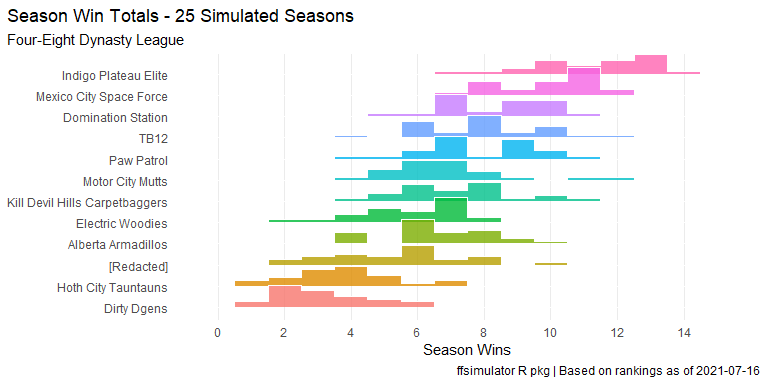

<!-- README.md is generated from README.Rmd. Please edit that file -->

# ffsimulator <a href='#'></a>

<!-- badges: start -->
<!-- [](https://CRAN.R-project.org/package=ffsimulator)  -->

[](https://ffsimulator.ffverse.com/)
[](https://lifecycle.r-lib.org/articles/stages.html)
[](https://github.com/ffverse/ffsimulator/actions)
[](https://codecov.io/gh/ffverse/ffsimulator?branch=dev)
[](https://discord.com/invite/5Er2FBnnQa)

<!-- badges: end -->

The `{ffsimulator}` package uses bootstrap resampling to run fantasy
football season simulations supported by historical rankings and
nflfastR data, calculating optimal lineups, and returning aggregated
results. This package can quickly run your league through hundreds of
seasons and may help you study:

-   expected season finishes and range of outcomes
-   player contributions to season wins
-   roster constructions
-   effects of (potential) trades
-   and more!

This package is part of the [ffverse](https://ffverse.com) family of R
packages for fantasy football analysis.

## Installation

Install the stable version of this package from the [ffverse r-universe
repository](https://ffverse.r-universe.dev):

``` r
install.packages("ffsimulator", repos = "https://ffverse.r-universe.dev")
```

Install the development version with either [DynastyProcess’s
r-universe](https://dynastyprocess.r-universe.dev) or remotes + GitHub:

``` r
# ffverse's r-universe
install.packages("ffsimulator", repos = "https://dynastyprocess.r-universe.dev")

# or via GitHub c/o remotes/devtools: # install.packages('remotes')
remotes::install_github("ffverse/ffsimulator")
```

The dev version has a [separate documentation site
here](https://ffsimulator.ffverse.com/dev/).

## Usage

A season simulation can be run as follows:

``` r
foureight_conn <- mfl_connect(2021, 22627)

foureight_sim <- ff_simulate(conn = foureight_conn, n_seasons = 25, n_weeks = 14)

autoplot(foureight_sim)
```


Please also see the

-   [basic usage](https://ffsimulator.ffverse.com/articles/basic.html)
    and
-   [custom
    simulations](https://ffsimulator.ffverse.com/articles/custom.html)

vignettes for more detailed introductions.

## Getting help

The best places to get help on this package are:

-   the [nflverse discord](https://discord.com/invite/5Er2FBnnQa) (for
    both this package as well as anything R/NFL related)
-   opening [an
    issue](https://github.com/dynastyprocess/ffsimulator/issues/new/choose)

## Contributing

Many hands make light work! Here are some ways you can contribute to
this project:

-   You can [open an
    issue](https://github.com/dynastyprocess/ffsimulator/issues/new/choose)
    if you’d like to request specific data or report a bug/error.

-   You can [sponsor this project with
    donations](https://github.com/sponsors/tanho63)!

-   If you’d like to contribute code, please check out [the contribution
    guidelines](https://ffsimulator.ffverse.com/CONTRIBUTING.html).

## Terms of Use

The R code for this package is released as open source under the [MIT
License](https://ffsimulator.ffverse.com/LICENSE.html). Fantasy football
and NFL data accessed by this package belong to their respective owners,
and are governed by their terms of use.
