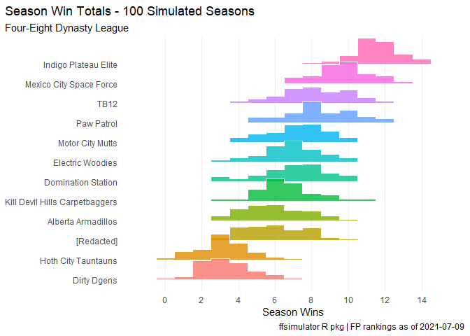
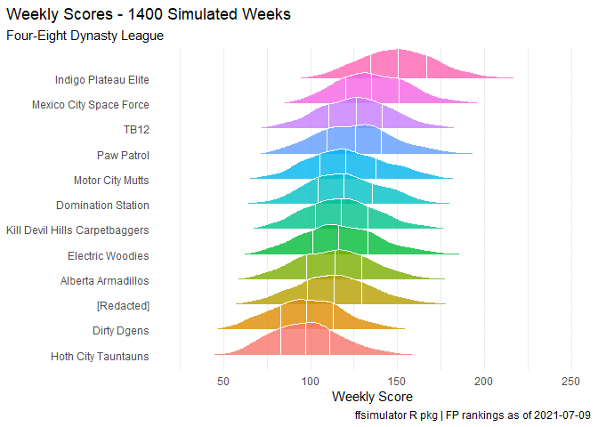

R Notebook
================

``` r
library(ffsimulator)
library(ggplot2)
conn <- mfl_connect(2021,22627)

sims <- ff_simulate(conn)

autoplot(sims)
```

<!-- -->

``` r
autoplot(sims,"rank")
```

<!-- -->

``` r
autoplot(sims,"points")
```

    ## Picking joint bandwidth of 4.81

<!-- -->
